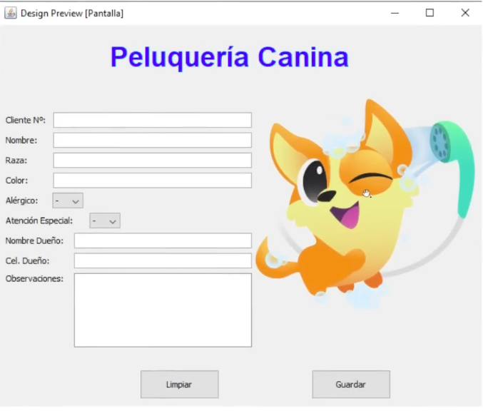

# Ejercicio Integrador: Peluqueria Canina

Una peluqueria canina necesita de <strong>un formulario</strong> para <strong>almacenar los datos de cada una de sus mascotas clientes</strong>. Para ello, solicita el desarrollo de una aplicación que sea capaz de registrar los siguientes datos de cada una de ellas y sus dueños:

 

<ul>
 <li>
    <strong>Mascota</strong>: num_cliente, nombre_perro, raza, color, alergico, atencion_especial, observaciones.
 </li>
 <li>
    <strong>Dueño</strong>: id_duenio, nombre, celular, direccion
 </li>
</ul>

Para poder registrar de manera sencilla y que sea atrativa para el usuario, la dueña de la peluquerua canina proporciona el diseño <strong>APROXIMADO</strong> de la que tiene para la interfaz gráfica de usuario:

Como los <strong>datos</strong> deben permanecer en el tiempo y a futuro los empleados de la peluqueria van a poder acceder a ellos, se requiere que cada uno de los registros sean almacenados en una <strong>base de datos</strong>.

A partir de este relevamiento de requerimientos:

<ul>
    <li>
        Realizar el desarrollo de una <strong>aplicación de escritorio</strong> que sea capaz de registrar, en una base de datos, los datos tanto de mascotas como dueños que se ingresen desde una interfaz gráfica de usuario.
    </li>
    <li>
        Para este desarrollo tener en cuenta los conceptos del <strong>MODELOS DE CAPAS</strong>
    </li>
</ul>
        Para este desarrollo tener en cuenta los conceptos del <strong>MODELOS DE CAPAS</strong>
    </li>
</ul>
 
# Compilación y Ejecución del programa

Compila el código fuente: 
 `mvn compile`.

Eliminar carpeta target y compila el programa: 
 `mvn clean compile`.

Compila, ejecuta pruebas y empaqueta el código en un JAR en la carpeta target: 
 `mvn package`.

Ejecuta el programa: 
 mvn javac:java
